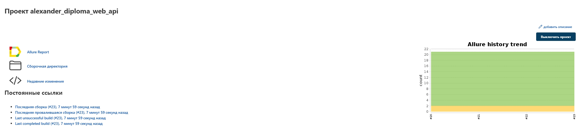
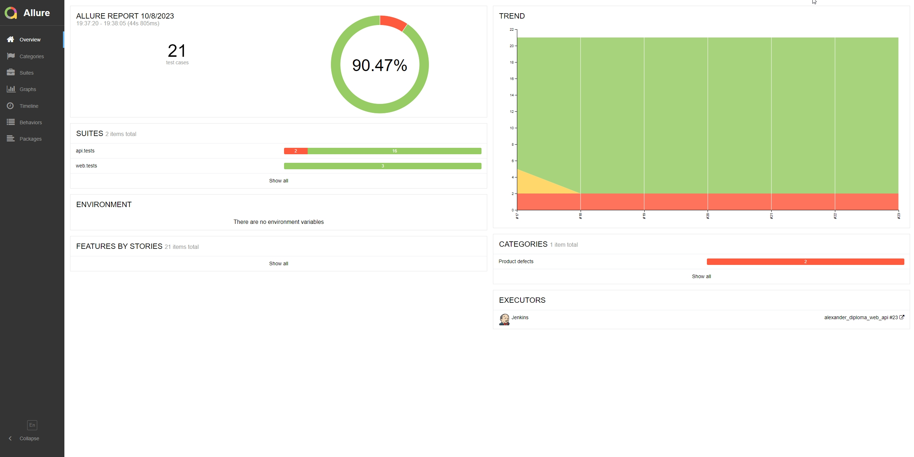
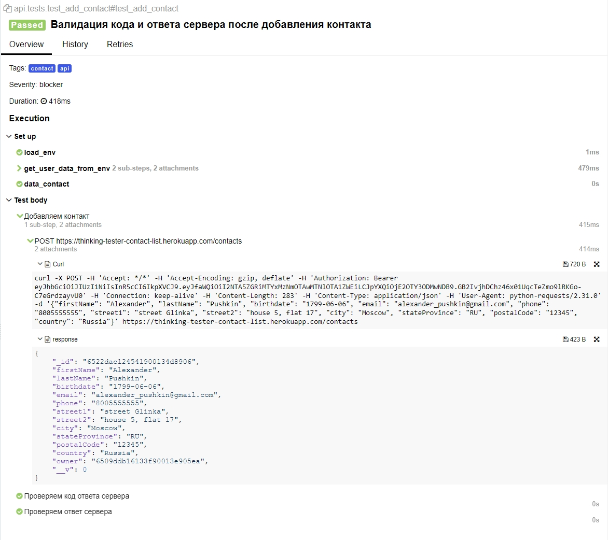
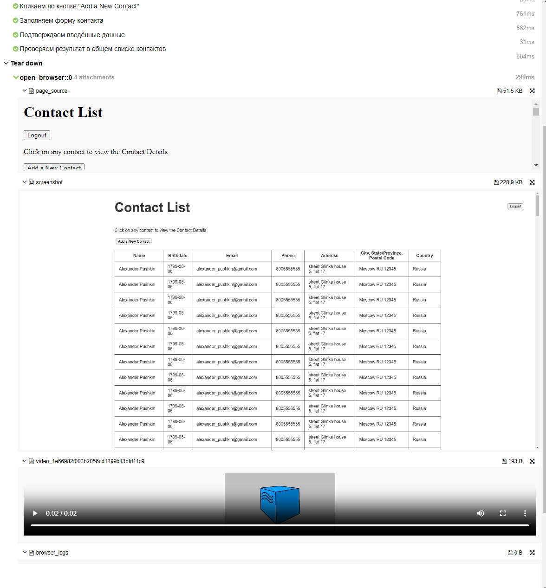
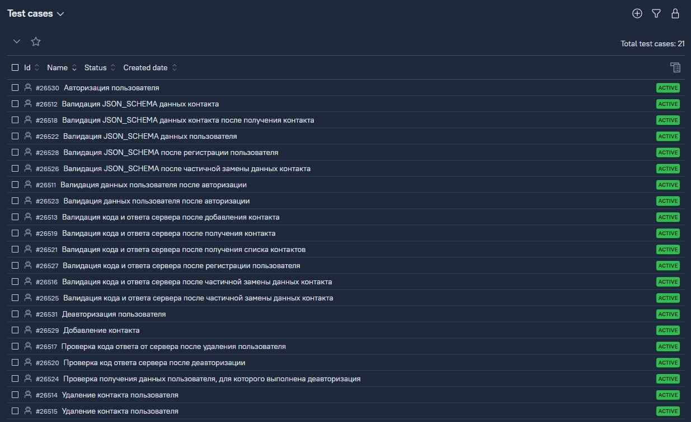
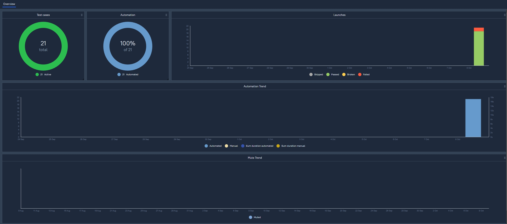
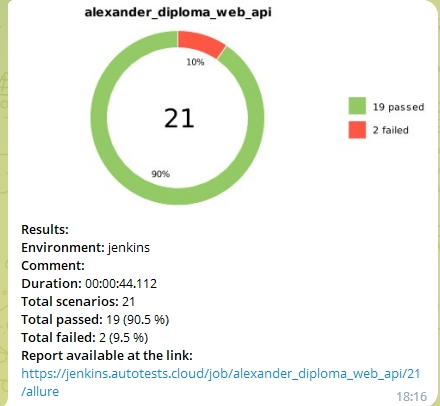
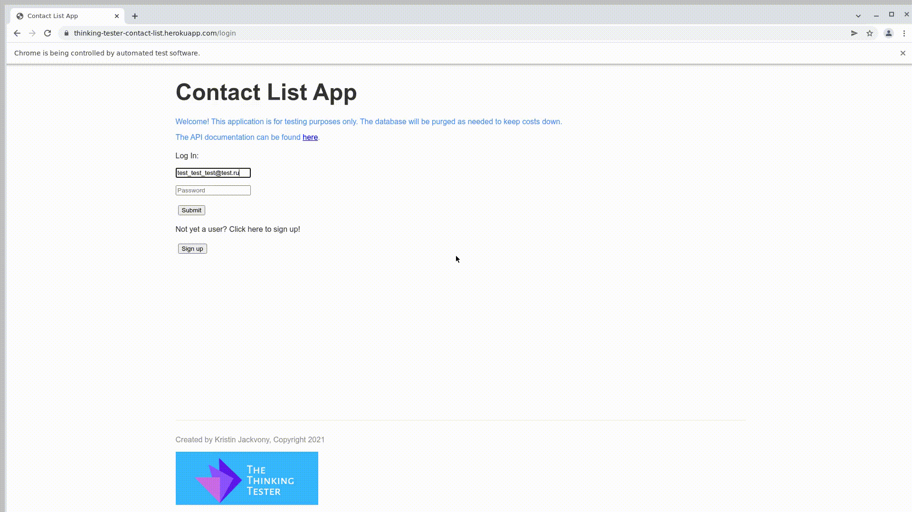

# QA Guru: Дипломный проект
Реализация набора автотестов (UI, API) для сервиса <code>thinking-tester-contact-list.herokuapp</code>


Весь проект выполнен на языке <code>Python</code>, а также дополнительно:
 - для UI-тестов применялись: <code>Selene</code>
 - для API-тестов применялись: <code>Requests</code>, <code>JSONSchema</code>

Запуск тестов и формирование отчетов о запусках формируется с помощью:
 - <code>Jenkins;</code>
 - <code>Selenoid;</code>
 - <code>Allure TestOps.</code>

# Покрытый функционал

## <a href='https://github.com/AlexanderKashkin/diploma/tree/main/web/tests'>UI-тесты</a>
 - авторизация пользователя;
 - добавление контакта в список контактов пользователя;
 - выход из учетной записи.

## <a href='https://github.com/AlexanderKashkin/diploma/tree/main/api/tests'>API-тесты</a>
 - получение профиля пользователя;
 - регистрация пользователя;
 - удаление пользователя;
 - авторизация пользователя;
 - выход из учётной записи;
 - добавление контакта в список контактов пользователя;
 - получение информации о контакте;
 - частичное обновление информации о контакте;
 - полное обновление информации о контакте;
 - удаление контакта пользователя.

## Подготовка перед запуском
- создать файл с данными уже существующего пользователя;
- создать файл с данными об удалённом сервере selenoid;
- создать файл с данным об телеграм-боте, куда необходимо отправить данные о прохождении тестов.

## Полезные ссылки
 - [Тестируемое web-приложение](https://thinking-tester-contact-list.herokuapp.com/);
 - [Job Jenkins](https://jenkins.autotests.cloud/job/alexander_diploma_web_api/);
 - [Allure report](https://jenkins.autotests.cloud/job/alexander_diploma_web_api/allure/).

## Запуск автотестов

```
python -m venv .venv
source .venv/bin/activate
pip install -r requirements.txt
pytest .
```

## Интеграция с Jenkins
- для запуска тестов на сервере настроена job'a в Jenkins.


## Интеграция с Allure
- после прохождения тестов будет собран отчёт на основе генератора Allure;

- к api тестам приложены logs, cUrl;

- к UI тестам приложены video, html, logs, screenshot;


## Интеграция с Allure TestOps
- результаты прохождения тестов, а также сами тест-кейсы будут отправлены в TestOps Allure;

- на основе результатов будет сгенерирован дашборд


## Нотификация в Telegram
- после прохождения тестов результаты будут отправлены в Telegram.


## Пример прохождения UI-теста

